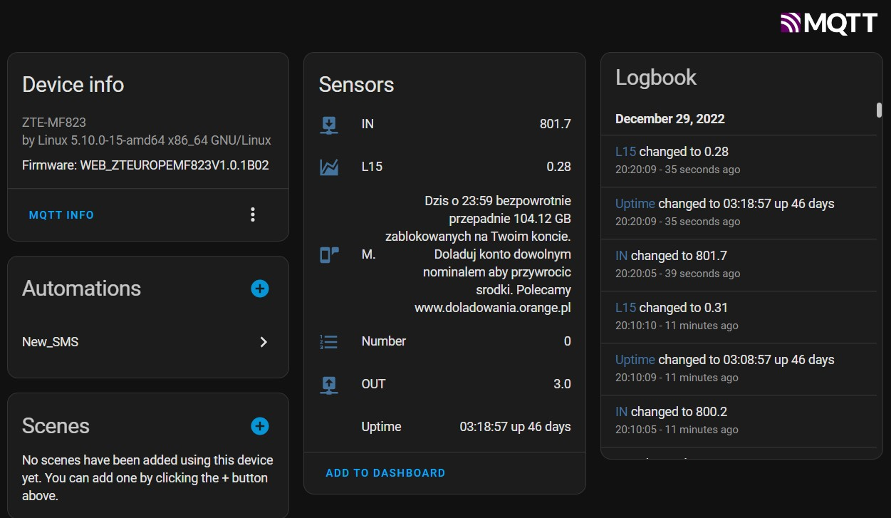

# ZTE MF823 HA SMS & MQTT
 ZTE MF823 SMS and stats/telemery to MQTT

Reguirements:
`mosquitto_pub
jq`

Copy zte.ze to home folder:
`cp zte.sh ~/scripts/zte.sh`

Add it to crone for examlpe every 10 minutes:
`*/10 * * * * root       /home/luk/scripts/zte.sh`

Script get basic telemetry from ZTE MF823 and send it to MQTT serwer in Home Assistant schema.
It collect and send listed below data:
IN - inpu mode transfer,
OUT - output modem transfer,
MSG - last SMS,
L15,
Uptime.

Additionaly I set up automation `/sms_automation.yaml/` which push notification containing SMS to my phone.

